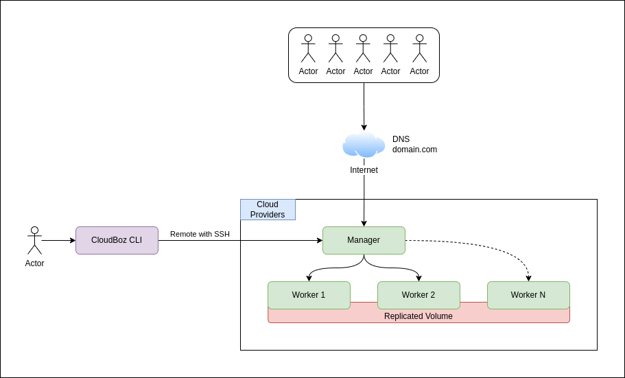

# CloudBoz CLI

Agent-less cloud management tool

## Features

### Commons

- [x] Docker Engine
- [x] Docker Limit Logs
- [x] Docker System Prune
- [x] Docker Swarm
- [x] Docker Swarm Network
- [x] Kong Gateway
- [x] GlusterFS Storage

### Apps

- [] PostgreSQL
- [] Redis
- [] RabbitMQ
- [] MinIO

# Architecture



# Requirements

- Ubuntu >= 18.04
- Ansible

# Install

- Clone this repository

```
cd ~; git clone -b main https://github.com/cloudbozcom/cli cloudboz
```

- Install ansible

```
sudo apt update
sudo apt install software-properties-common
sudo add-apt-repository --yes --update ppa:ansible/ansible
sudo apt install ansible
```

- Go to `/home/$USER/cloudboz` then run

```
ansible-galaxy install community.docker
```

- Install cloudboz CLI to bash profile

```
echo 'alias cbz="ansible-playbook cloudboz.yml"' >> ~/.bashrc
```

# How to run?

- Open this file `group_vars/global.yml` and change anything you need.
- Copy your ssh private key from server to this file `files/ssh.key`.
- Run this command `chmod 400 files/ssh.key`.
- Insert your server IP in this file `ansible.host`.

```
cbz --tags "common" --extra-vars "group=development pkg_name=apache2"
```
